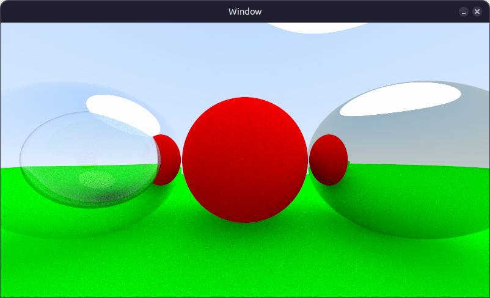
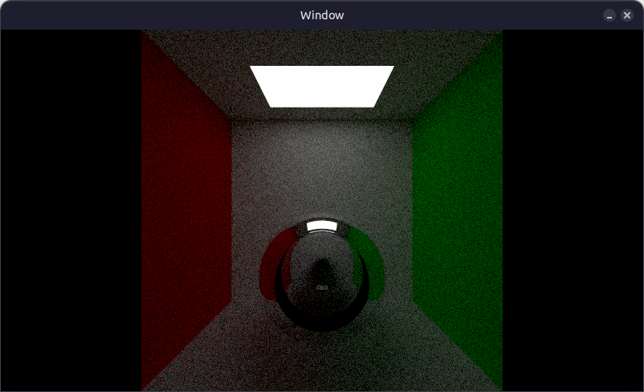
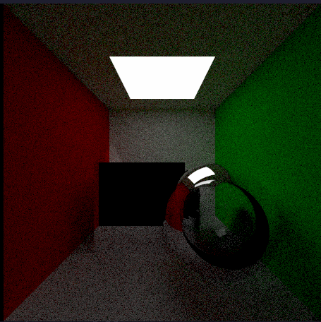

# Ray Tracer (Raylib + C++)

This branch of the repository is a complete rewrite of the original manual implementation. While the main branch remains strictly faithful to the "Ray Tracing in One Weekend" series (using custom-built math and data structures), this branch integrates Raylib’s native functions and data types.

A simple ray tracer built in C++ using Raylib for visualization, largely following the concepts and structure from the "Ray Tracing in One Weekend" series by Peter Shirley.





## Overview

This project is an implementation-focused exploration of fundamental ray tracing techniques, including:

* Ray–object intersection
* Diffuse and reflective materials
* Camera and viewport setup
* Recursive ray scattering
* Anti-aliasing via sampling

Rendering is displayed in real time using Raylib instead of writing directly to image files, making it easier to visualize progress and experiment interactively.

### Inspiration

This project is primarily based on the tutorial series:
"Ray Tracing in One Weekend" by Peter Shirley
The implementation adapts the original ideas to work with a real-time rendering loop powered by Raylib.

### Features
* Basic sphere rendering
* Lambertian (diffuse) materials
* Metal (reflective) materials
* Glass (dielectric) materials
* Simple camera system
* Anti-aliasing using multiple samples per pixel
* Recursive ray tracing for global illumination effects
* Real-time display using Raylib

### Tech Stack
* Language: C++
* Graphics Library: Raylib
* Project Structure

## Build & Run
### Requirements
 * C++ compiler (g++ recommended)
 * Raylib installed

### Compile
```
g++ src/main.cpp -o raytracer -lraylib -lm -lpthread -ldl -lrt -lX11
```
### Run
```
./raytracer
```

## Future Improvements
* Acceleration structures (BVH)
* Textures and image mapping
* Multithreading for faster rendering
* Scene editor / camera controls

## Acknowledgements
Peter Shirley for the Ray Tracing in One Weekend series
Raylib for simple and effective graphics rendering
